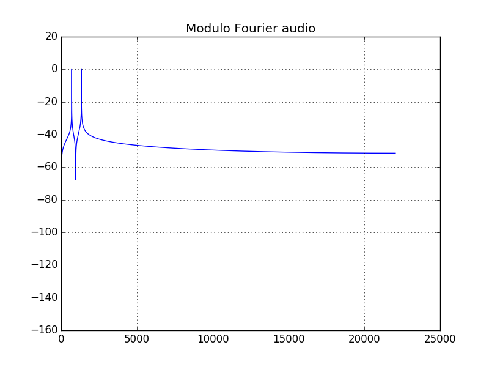
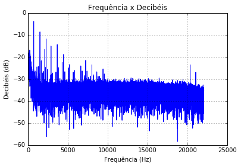
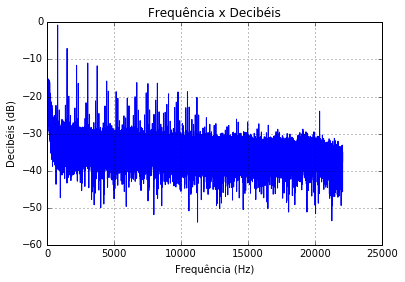
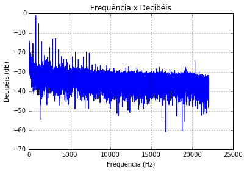
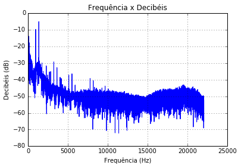

# Camada Física -  Projeto 5 - DTMF
Por: Isabella Oliveira e Vitória Camilo (Insper)

## Geração dos tons
Os tons são gerados a partir da soma de duas ondas senoides. A fórmula utilizada foi *sen(wt)* para gerar a onda, onde *w = 2πf*. O arquivo onde os tons são gerados, reproduzidos, e plotados pela primeira vez é o *encoderDTMF.py*.

## Frequências que compõem cada tom 
|             |1209 Hz  |1336 Hz  |1477 Hz  |
|:-----------:|---------|---------|---------|
|**697 Hz**   |1        |2        |3        |
|**770 Hz**   |4        |5        |6        |
|**852 Hz**   |7        |8        |9        |
|**941 Hz**   |*        |0        |#        |

## Tons Gerados e Captados

Nos gráficos abaixo relaciona-se o sinal de tom no decorrer do tempo. Na esquerda estão as soma dos senos das duas frequências utilizadas, e na direita o gráfico do som que foi gravado de um computador que escutava o outro. As visíveis disparidades entre os gráficos correspondem as interferencias presentes em meio a gravação. O arquivo com o código que escuta, grava e plota um novo gráfico é o *decoderDTMF.py*.

| Tom | Primeira plotagem                  |Ondas Captadas               |
|:-----:|-------------------------|----------------------|
|1      |         |       |
|2      |         |       |
|3      |         |       |
|4      |         |       |
|5      |         |       |
|6      |         |       |
|7      |         |       |
|8      |         |       |
|9      |         |       | 
|0      |         |       |
|*      |   |    |
|#      |      | |

## Sinais Enviados e Recebidos

| Tom   | Sinal Enviado       |Sinal Recebido         |
|:-----:|-------------------------|----------------------|
|1      |         |      |
|2      |         |      |
|3      |         |      |
|4      |         |      |
|5      |         |      |
|6      |         |      |
|7      |         |      |
|8      |         |      |
|9      |         |      | 
|0      |         |      |
|*      |   |   |
|#      |      ||

## Frequências enviadas e recebidas
As frequências enviadas são recebidas com pouca discrepância, pois há pouco ruído, mas foi necessário o uso do software Audacity, pois a função peakutils muitas vezes não reconhecia os picos corretamente.

Tom 1: 

Frequências Enviadas: 697, 1209 

Frequências Recebidas: 697, 1210 

Tom 2: 

Frequências Enviadas: 697, 1336

Frequências Recebidas: 697, 1335

Tom 3: 

Frequências Enviadas: 697, 1477

Frequências Recebidas: 697, 1477

Tom 4: 

Frequências Enviadas: 770, 1209 

Frequências Recebidas: 769, 1211 

Tom 5: 

Frequências Enviadas: 770, 1336

Frequências Recebidas: 770, 1337 

Tom 6: 

Frequências Enviadas: 770, 1447

Frequências Recebidas: 769, 1351 

Tom 7: 

Frequências Enviadas: 852, 1209 

Frequências Recebidas: 852, 1208

Tom 8: 

Frequências Enviadas: 852, 1336 

Frequências Recebidas: 852, 1337 

Tom 9: 

Frequências Enviadas: 852, 1477 

Frequências Recebidas: 853, 1477 

Tom 0: 

Frequências Enviadas: 941, 1336 

Frequências Recebidas: 943, 1336 

Tom *: 

Frequências Enviadas: 941, 1209 

Frequências Recebidas: 941, 1277 

Tom #: 

Frequências Enviadas: 941, 1477 

Frequências Recebidas: 941, 1477

## Tempos utilizados
Os audios transmitidos tem duração de 1 segundo, o mesmo setado na geração dos tons, e os gráficos são gerados para cada 1 segundo recebido, captando, assim, cada audio de tom por completo.
